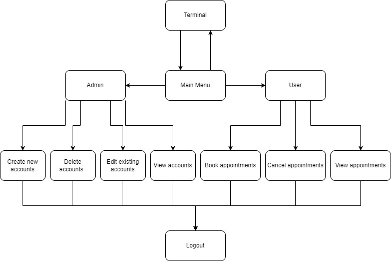
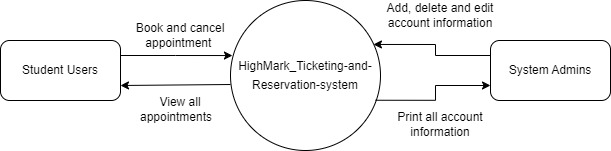

# HighMark_Ticketing-and-Reservation-system

## Project Introduction

This project is an appointment system based on the C programming language. It allows admins to create, delete, and edit accounts, and users to create, query, and delete appointments.

## Technology Stack and Tools

This project is developed in `C`, using `GCC` as the compiler, and `Make and/or CMake` for project construction.

## Installation and Running Guide

After downloading the source code, use the `make` command for compilation, and then run the generated executable file with command `./main.o`.

## Requirements

### Account Management

-   The system should provide functions for adding, modifying, and deleting account information.

### Appointment Management

-   Users should be able to create new appointments, with details including appointment type, date, and time.
-   Users should be able to view all of their appointments in a clear, organized manner.
-   Users should be able to delete existing appointments.
-   The system should handle conflicts and avoid appointment overlap.

## System Design and Implementation

The system uses a linked list data structure to store appointment information and implements functionalities for creating, querying, and deleting appointments.

### Architecture Design

### Context Diagram

## Testing and Validation

The system has been thoroughly tested by writing and running test cases.

| Test ID | Description                                             | Expected Input            | Expected Output                     | Actual Output                       | PASS/FAIL |
| ------- | ------------------------------------------------------- | ------------------------- | ----------------------------------- | ----------------------------------- | --------- |
| T_01    | Provide correct information for login                   | username, password, type  | `Successfully logged in!`           | `Successfully logged in!`           | Pass      |
| T_02    | Provide incorrect password for login                    | username, password, type  | `Incorrect account information!`    | `Incorrect account information!`    | Pass      |
| T_03    | Print all account information                           | choice 4                  | `Print all account information`     | `Print all account information`     | Pass      |
| T_04    | Create a new appointment                                | appointment details       | `Appointment created successfully`  | `Appointment created successfully`  | Pass      |
| T_04_01 | Create a new appointment with duplicated time           | appointment details       | `The time you selected is invalid!` | `The time you selected is invalid!` | Pass      |
| T_05    | View all existing appointment                           | choice 1                  | `Details of the appointments`       | `Details of the appointments`       | Pass      |
| T_06    | Delete an existing appointment                          | start time of appointment | `Appointment deleted successfully`  | `Appointment deleted successfully`  | Pass      |
| T_06_01 | Provide incorrect information when deleting appointment | start time of appointment | `The appointment is incorrect!`     | `The appointment is incorrect!`     | Pass      |
| T_07    | Select the date before the current time                 | day, month, year          | `The given date is unavailable!`    | `The given date is unavailable!`    | Pass      |
| T_08    | Select an invalid date                                  | day, month, year          | `The given date is invalid!`        | `The given date is invalid!`        | Pass      |
| T_09    | Create a new account                                    | account details           | `Account created successfully`      | `Account created successfully`      | Pass      |
| T_10    | Edit an existing account                                | account ID, new details   | `Account updated successfully`      | `Account updated successfully`      | Pass      |
| T_10_01 | Provide incorrect information when editing account      | account ID, new details   | `The account does not exist!`       | `The account does not exist!`       | Pass      |
| T_11    | Delete an existing account                              | account ID                | `Account deleted successfully`      | `Account deleted successfully`      | Pass      |

## Project Summary and Reflection

During the project development process, I have gained a deep understanding of the application of linked list data structures and pointers, and improved my capabilities in C language programming and project management.
